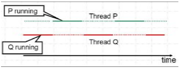
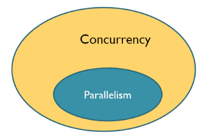
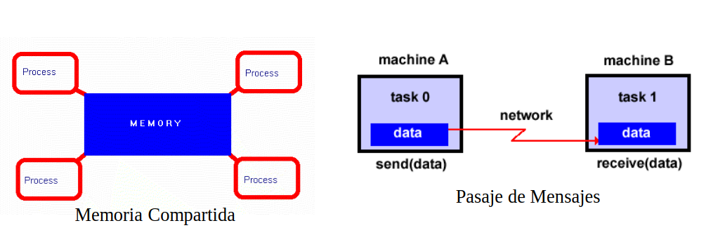
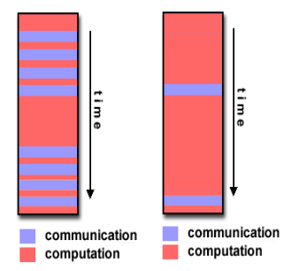

# Clase 1
Concurrencia: Concepto de software no restringido a una arquitectura particular de hardware ni a un número determinado de procesadores.
Especificar la concurrencia implica especificar los procesos concurrentes, su comunicación y su sincronización.

Programas cocurrentes pero **NO** paralelos tienen menor speed up,es una sola maquina dedicando tiempo a multiples componentes del objeto.



> [!NOTE] Un programa concurrente especifica dos o más “programas secuenciales” que pueden ejecutarse concurrentemente en el tiempo como tareas o procesos.

Paralelismo: 
Se asocia con la ejecución concurrente en múltiples procesadores con el objetivo principal de reducir el tiempo de ejecución.



## Objetivos de los sistemas concurrentes
- Ajustar el modelo de arquitectura de hardware y software al problema del
mundo real a resolver.
- Incrementar la performance, mejorando los tiempos de respuesta de los
sistemas de cómputo, a través de un enfoque diferente de la arquitectura
física y lógica de las soluciones


Los procesos o tareas pueden:
- Ser independientes
- Competir por un recurso, más tipico aparece el concepto de deadlock e inanición.
- Cooperar: Los procesos se combinan para resolver una tarea común y es necesario un momento de sincronización

## Comunicación entre procesos
La comunicación entre procesos concurrentes indica el modo en
que se organizan y trasmiten datos entre tareas concurrentes.
Esta organización requiere especificar protocolos para controlar
el progreso y la corrección. Los procesos se COMUNICAN:
- Por Memoria Compartida.
- Por Pasaje de Mensajes.



### Memoria compartida
Los procesos intercambian información sobre la memoria compartida o
actúan coordinadamente sobre datos residentes en ella.
Lógicamente no pueden operar simultáneamente sobre la memoria
compartida, lo que obliga a bloquear y liberar el acceso a la memoria.
La solución más elemental es una variable de control tipo “semáforo” que
habilite o no el acceso de un proceso a la memoria compartida.

### Pasaje de mensajes
Es necesario establecer un canal (lógico o físico) para transmitir información entre procesos.
También el lenguaje debe proveer un protocolo adecuado.
Para que la comunicación sea efectiva los procesos deben “saber” cuándo
tienen mensajes para leer y cuando deben trasmitir mensajes.

## Sincronización
La sincronización es la posesión de información acerca de otro proceso para
coordinar actividades. Los procesos se sincronizan:
- Por exclusión mutua: Asegurar que sólo un proceso tenga acceso a un recurso compartido en un instante de tiempo.

    Si el programa tiene secciones críticas que pueden compartir más de un
proceso, la exclusión mutua evita que dos o más procesos puedan encontrarse
en la misma sección crítica al mismo tiempo
- Por condición: Permite bloquear la ejecución de un proceso hasta que se cumpla una condición dada.

## Interferencia
Un proceso toma una acción que invalida las suposiciones hechas por otro proceso

## Prioridad
Un proceso que tiene mayor prioridad puede causar la suspensión
(preemption) de otro proceso concurrente.
Análogamente puede tomar un recurso compartido, obligando a
retirarse a otro proceso que lo tenga en un instante dado

## Granularidad
La granularidad de una aplicación está dada por la relación entre el cómputo y la comunicación.
Relación y adaptación a la arquitectura. Es deseable que la granularidad de la aplicación coincida con la de la maquina en la que se esta corriendo.
Grano fino y grano grueso: refiere a que tanta comunicación/computo se realiza. //recordar que es sobre la granularidad de una apliación, se ve tambien para tipos de instrucción. 




## Administración de recursos compartidos
Esto incluye la asignación de recursos compartidos, métodos de
acceso a los recursos, bloqueo y liberación de recursos, seguridad y
consistencia.
- Una propiedad deseable en sistemas concurrentes es el equilibrio en
el acceso a recursos compartidos por todos los procesos (fairness).
- Dos situaciones NO deseadas en los programas concurrentes son la
inanición de un proceso (no logra acceder a los recursos
compartidos) y el overloading de un proceso (la carga asignada
excede su capacidad de procesamiento).
### Se debe evitar el **deadlock**. 
Dos (o más) procesos pueden entrar en deadlock, si por error de
programación ambos se quedan esperando que el otro libere un
recurso compartido.
Existe **Deadlock** si:
- Recursos reusables serialmente: los procesos comparten recursos que
pueden usar con exclusión mutua.
- Adquisición incremental: los procesos mantienen los recursos que
poseen mientras esperar adquirir recursos adicionales.
- No-preemption: una vez que son adquiridos por un proceso, los
recursos no pueden quitarse de manera forzada sino que sólo son
liberados voluntariamente.
- Espera cíclica: existe una cadena circular (ciclo) de procesos tal que
cada uno tiene un recurso que su sucesor en el ciclo está esperando
adquirir.
---
Problemas genéricos de la Programación concurrente:
- Hay un no determinismo implícito en el interleaving de procesos concurrentes. Esto significa que dos ejecuciones del mismo programa no necesariamente
son idénticas -> dificultad para la interpretación y debug.
- Posible reducción de performance por overhead de context switch,
comunicación, sincronización, ...
- Mayor tiempo de desarrollo y puesta a punto. Difícil paralelizar algoritmos secuenciales.
- Necesidad de adaptar el software concurrente al hardware paralelo para
mejora real en el rendimiento


---

## Concurrencia a nivel de hardware
Nos dedicamos más a la concurrencia a nivel de aplicación. Hace referencia a la concurrencia que nos da la arquitectura sobre la que estamos trabajando y ya el simple hecho de que acciones se ejecuten en un pipeline es concurrente. Durante mucho tiempo se busco mejorar arquitecturas monoprocesadores, hoy se da una concurrencia para mejorar la performance con maquinas multicore

UMA = Uniform memory access. Todos acceden a la misma memoria

NUMA = not uniform memory access. Los procesos tienen partes de la memoria en la que tienen acceso más rápido y un bus compartido para acceder a las partes más lejanas.


---
## Acciones y sincro
Estado de un programa concurrente: En un cierto momento N (si freno la ejecución) como estan los registros y datos del programa.

Cada proceso ejecuta una secuencia de sentencias que se pueden corresponder con una o más acciones atómicas

>[!NOTE]
> Una acción atómica hace una transformación de estado
indivisibles (estados intermedios invisibles para otros procesos). NO puede haber interferencia.

Muchos procesos se ejecutan y se van intercalando sus acciones atómicas, generando lo que se conoce como interliving, y cada una de las posibles combinaciones de todas las acciones atómicas que conforman el programa se conocen como Historia (muchas de ellas no son válidas o generan resultados no esperados). La interacción entre los procesos nos permite definir cuál de las historias es válida.

**Acciones de grano fino** o atómica = Implementadas por hardware. Son indivisibles.

## Referencia critica
referencia a una variable que es modificada por otro proceso
## "A lo sumo una vez"
Una expresiones e que no está en una sentencia de asignación satisface la propiedad de “A lo sumo una vez” si no contiene más de una referencia crítica => Puede haber a lo sumo una variable compartida, y puede ser referenciada a lo sumo una vez\

<await (B)> sincronización por condición: si se cumple que B ASV se puede reescribir usando **busy waiting** como:
```C
do (not B) -> skip od

o

while(not B);
```

---
## Propiedades
Una **propiedad** de un programa concurrente es un atributo verdadero en cualquiera de las historias de ejecución del mismo
Toda propiedad puede ser formulada en términos de dos clases: seguridad y vida.
- seguridad (safety) : Nada malo le ocurre a un proceso: asegura estados consistentes.\
    Ejemplos de propiedades de seguridad: exclusión mutua, ausencia de interferencia entre procesos, partial correctness(siempre que un proceso termina nos asegura que el resultado es correcto, no asegura que termine).
- vida (liveness): Eventualmente ocurre algo bueno con una actividad: progresa, no ha deadlocks. Una falla de vida indica que las cosas dejan de ejecutar. \
    Ejemplos de vida: terminación, asegurar que un pedido de servicio será atendido, que un mensaje llega a destino, que un proceso eventualmente alcanzará su SC, etc => dependen de las políticas de scheduling.

## Fairness
Trata de garantizar que los procesos tengan chance de avanzar, sin importar lo que hagan los demás. -> no vale esperar sin hacer nada.
Una acción atómica en un proceso es elegible si es la próxima acción atómica en el proceso que será ejecutada. Si hay varios procesos, hay varias acciones atómicas elegibles.
Una política de scheduling determina cuál será la próxima en ejecutarse.

- Fairness Incondicional. Una política de scheduling es incondicionalmente
fair si toda acción atómica incondicional que es elegible eventualmente es
ejecutada

- Fairness Débil. Una política de scheduling es débilmente fair si :
(1) Es incondicionalmente fair y
(2) Toda acción atómica condicional que se vuelve elegible eventualmente es ejecutada, asumiendo que su condición se vuelve true y permanece true hasta que es vista por el proceso que ejecuta la acción atómica condicional.
No es suficiente para asegurar que cualquier sentencia await elegible eventualmente se ejecuta: la guarda podría cambiar el valor (de false a true y nuevamente a false) mientras un proceso está demorado.

- Fairness Fuerte. Una política de scheduling es fuertemente fair si:
(1) Es incondicionalmente fair y
(2) Toda acción atómica condicional que se vuelve elegible eventualmente es ejecutada pues su guarda se convierte en true con infinita frecuencia.