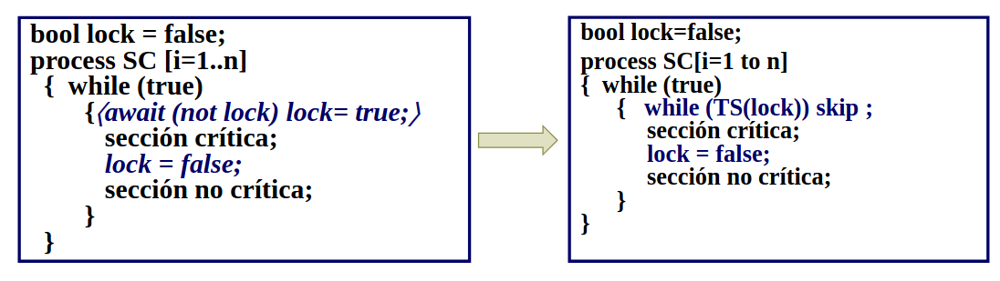
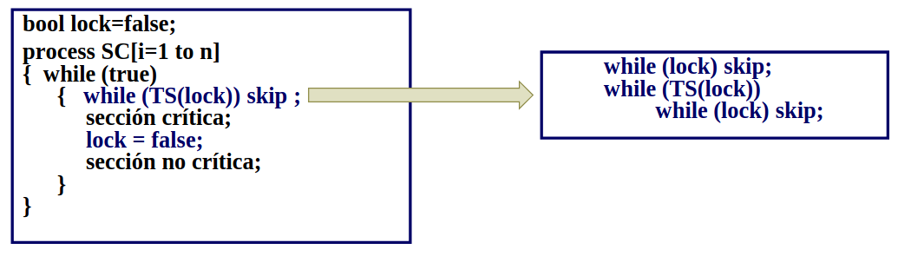

# Clase 2
## Sincronización por variables compartidas
Problema de la Sección Crítica: implementación de acciones atómicas en software (locks). Determinar por software partes o bloques de código con exclusión mutua.
Barrera: punto de sincronización que todos los procesos deben alcanzar para que cualquier proceso pueda continuar.

Propiedades de sección crítica:
- Exclusión mutua: A lo sumo un proceso está en su SC.
- Ausencia de Deadlock (Livelock): si 2 o más procesos tratan de entrar a sus SC, al menos uno tendrá éxito.
- Ausencia de Demora Innecesaria: si un proceso trata de entrar a su SC y los otros están en sus SNC o terminaron, el primero no está impedido de entrar a su SC.
- Eventual Entrada: un proceso que intenta entrar a su SC tiene posibilidades de hacerlo (eventualmente lo hará).

```c
process SC [i=1..n]
{ while (true)
{
<await (not lock) lock= true;>
sección crítica;
lock = false;
sección no crítica;
}
}
```

Cumple las 4 condiciones (la de eventual entrada depende del scheduler, fuertemente va y debilmente no deberiamos tener problema) pero sigue siendo de grano grueso.

Podemos reemplazar el await por Test&Set-> acción átomica incluida en muchos procesadores que devuelve el valor de la variable y la pone en true.



Para una todavia mejor solución ya que el TS siempre cambia el valor y puede ser ineficiente podemos reemplazarlo de la siguiente manera(igual no desaparece el problema, cuando look sea false todos van a intentar hacer TS)




---
Con los siguiente algoritmos garantizar la eventual entrada no depende del fair:
### Tie breaker
Lleva la cuenta de quien es el último que solicitó el recurso, cuando se va a desempatar pasa el que llegó antes. Para dos procesos es factible, generalizarlo lo vuelve mucho más complejo

### Ticket
Mantiene una variable número que corresponde con el próximo número a sacar, próximo que es el que tiene que pasar. Cada proceso al sacar saca un número y espera a que se lo llame -> a que sea el próximo. Podría llegar a ser necesario que de alguna manera se resetee el valor de las variables cuando no se esten utilizando = si próximo y número son iguales nadie quiere entrar y lo puedo dejar en 0 -> solo para evitar posibles desbordes. Usa fetch&Add que le suma a la variable que le pases y te devuelve el valor original antes de entrar.

### Backery
Cuando llega un proceso se compará con todos los demás procesos toma el que tenga el valor más alto e incrementa en uno ese valor, útil cuando no existe FA -> es un ticket descentralizado.

## Barrier
una barrera es un punto de demora a la que deben llegar todos los procesos antes de permitirles pasar y continuar su ejecución.

```c
FA(cantidad,1);
while (cantidad <> n) skip;
```

Ese código solo funciona para una iteración.
Seria más eficiente mantener un coordinador que mantenga que los procesos llegaron y avisarles que continuen.

### Barreras en forma de árboles
combining tree barrier : los procesos son worker y coordinador a la vez, las señales de arribo van hacia arriba en el árbol, y las de continuar hacia abajo. Más eficiente para n grande.

Barrera simetrica: Cuando dos procesos se sincronizan y estos a su vez se sincronizan con otros 2 (uno cada uno) podemos afirmar que los 4 procesos están sincronizados

Butterfly barrier: medio me perdí los combina para que Worker[1:n] arreglo de procesos. Si n es potencia de 2 y divide por log2n etapas: cada worker sincroniza con uno distinto en cada etapa. En la etapa s, un worker sincroniza con otro a distancia 2s-1