>[!quote] Alexander et al. 1977
> Cada patrón describe un **problema** que ocurre una y otra vez en nuestro **entorno**, y después describe el núcleo de la solución a ese problema, **de tal manera que** puedes usar esa solución un millón de veces, sin hacerlo de la misma manera dos veces

Un patrón es un par problema-solución. Los patrones tratan con problemas recurrentes y buenas soluciones (probadas) a esos problemas. La solución es suficientemente genérica para poder aplicarse de diferentes maneras 

>[!important]
> Tener en cuenta que los patrones mencionados en este resumen no son todos los que existen, sino los mencionados en la materia

# Patrón Adapter

#### **Intención**

"Convertir" la interfaz de una clase en otra que el cliente espera. Permite que ciertas clases con interfaces incompatibles puedan trabajar en conjunto 

#### **Aplicabilidad**

Usar Adapter cuando se quiere usar una clase existente y su interfaz no es compatible con lo que precisa 

#### **Estructura**

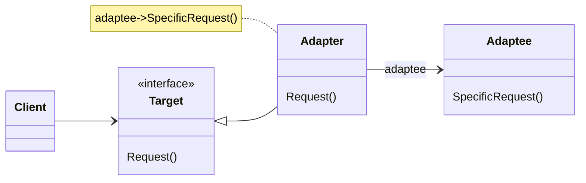

- **Target**: Define la interfaz específica que usa el cliente 
- **Client**: Colabora con los objetos que satisfacen la interfaz de Target
- **Adaptee**: Define una interfaz precisa para ser adaptada 
- **Adapter**: Adapta la interfaz del Adaptee a la interfaz Targer

#### **Consecuencias** 

- Una misma clase Adapter puede usarse para muchos Adaptees (el Adaptee y todas sus subclases)
- El Adapter puede agregar funcionalidad a los adaptados 
- Se generan más objetos intermedios 

# Patrón Template Method

#### **Intención**

Definir el esqueleto de un algoritmo en un método, difiriendo algunos pasos a las subclases. Permite que las subclases redefinan ciertos pasos de un algoritmo sin cambiar la estructura del algoritmo 

>[!Note]
> Es una técnica fundamental del reuso de código 

#### **Aplicabilidad**

- Para implementar las partes invariantes de un algoritmo una vez y dejar que las subclases implementen los aspectos que varían 
- Para evitar duplicación de código entre subclases 
- Para controlar las extensiones que pueden hacer las subclases 

#### **Estructura**

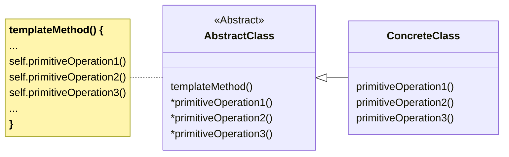

- **AbstractClass**: implementa un método que contiene el esqueleto de un algoritmo (el template method). Ese método llama a operaciones primitivas así como operaciones definidas en AbstractClass. Declara operaciones primitivas abstractas que las subclases concretas deben definir para implementar los pasos de un algoritmo
- **ConcreteClass**: implementa operaciones primitivas que llevan a cabo los pasos específicos del algoritmo

#### **Consecuencias**

 - Lleva a tener inversión de control (la superclase llama a las operaciones definidas en las subclases)
 - El template method llama a dos tipos de operaciones:
	 - operaciones primitivas (abstractas en AbstractClass y que las subclases tienen que definir)
	 - operaciones concretas definidas en AbstractClass y que las subclases pueden redefinir si hace falta (hook methods)

# Patrón Strategy

#### **Intención** 

Definir una familia de algoritmos, encapsular cada uno y hacerlos intercambiables. Permite que el algoritmo varíe independientemente de los clientes que lo usan. Además, permite cambiar (en forma dinámica), el algoritmo que se utiliza y brinda flexibilidad para agregar nuevos algoritmos que lleven a cabo una función determinada 

#### **Aplicabilidad**

- Existen muchos algoritmos para llevar a cabo una tarea
- No es deseable codificarlos todos en una clase y seleccionar cuál utilizar por medio de sentencias condicionales 
- Cada algoritmo utiliza información propia. Colocar esto en los clientes lleva a tener clases complejas y difíciles de mantener 
- Es necesario cambiar el algoritmo en forma dinámica, en tiempo de ejecución 

#### **Estructura**

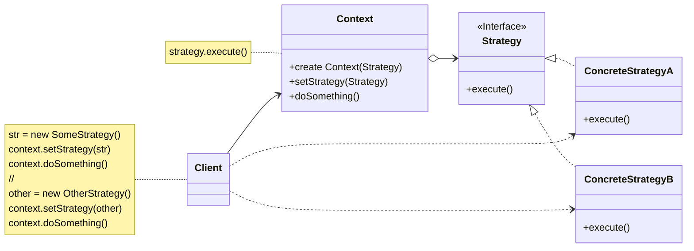

> [!note]
> Tener en cuenta que Strategy podría ser una clase abstracta en lugar de una interfaz 

#### **Consecuencias**

- Puntos a favor 
	- Mejor solución que subclasificar el contexto, cuando se necesita cambiar dinámicamente
	- Desacopla al contexto de los detalles de implementación de las estrategias 
	- Se eliminan los condicionales
- Puntos en contra
	- La clase cliente debe conocer las diferentes estrategias para poder elegir
	- Overhead en la comunicación entre el contexto y las estrategias

#### **Implementación** 

- El contexto debe tener métodos en su protocolo que permitan cambiar la estrategia 
- Parámetros entre el contexto y la estrategia. Hay que analizar qué datos se necesitan particularmente en cada caso 

# Patrón State 

#### **Intención**

Modificar el comportamiento de un objeto cuando su estado interno se modifica. Externamente parecería que la clase del objeto ha cambiado 

#### **Aplicabilidad** 

- El comportamiento de un objeto depende del estado en el que se encuentre
- Los métodos tienen sentencias condicionales complejas que dependen del estado. Este estado se representa usualmente por constantes enumerativas y en muchas operaciones aparece el mismo condicional. El patrón State reemplaza el condicional por clases (es un uso inteligente del polimorfismo)
- Desacoplar el estado interno del objeto en una jerarquía de clases 
- Cada clase de la jerarquía representa un estado concreto en el que puede estar el objeto
- Todos los mensajes del objeto que dependan de su estado interno son delegados a las clases concretas de la jerarquía (polimorfismo)

#### **Estructura** 

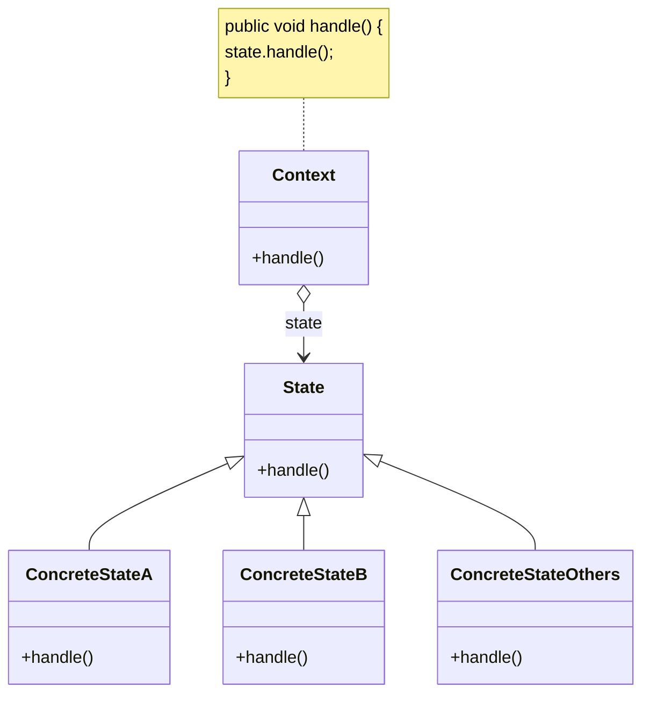

- **Context**: define la interfaz que conocen los clientes. Mantiene una instancia de alguna clase de ConcreteState que define el estado corriente 
- **State**: define la interfaz para encapsular el comportamiento de los estados de Context
- **ConcreteState subclases**: cada subclase implementa el comportamiento respecto al estado específico

#### **Consecuencias**

- Puntos a favor
	- Localiza el comportamiento relacionado con cada estado
	- Las transiciones entre estados son explícitas
	- En el caso que los estados no tengan variables de instancia pueden ser compartidos
- Puntos en contra 
	- En general hay bastante acoplamiento entre las subclases de State porque la transición de estados se hace entre ellas, por lo que deben conocerse entre sí

# Patrón Composite 

#### **Intención**

Componer objetos en estructuras de árbol para representar jerarquías parte-todo. El Composite permite que los clientes traten a los objetos atómicos y a sus composiciones uniformemente

#### **Aplicabilidad**

- Se quiere representar jerarquías parte-todo de objetos
- Se quiere que los objetos "clientes" puedan ignorar las diferencias entre composiciones y objetos individuales. Los clientes tratan a los objetos atómicos y compuestos uniformemente 

#### **Estructura**

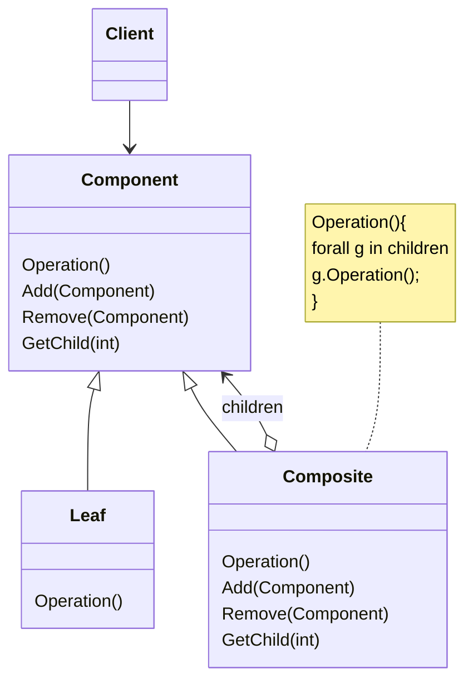

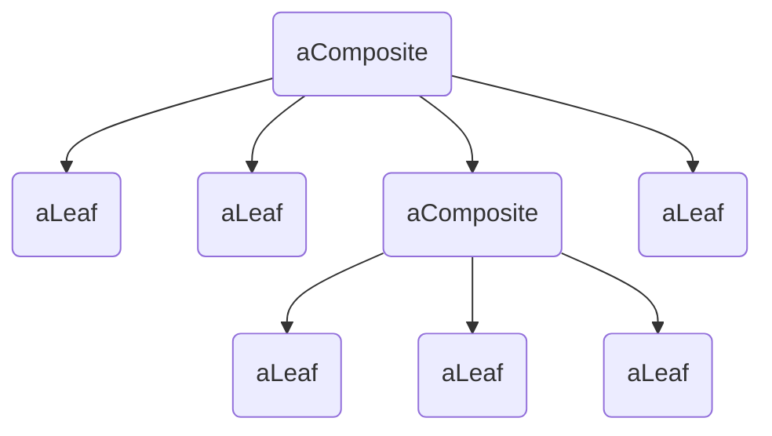

- **Component**: Declara la interfaz para los objetos de la composición. Implementa comportamientos default para la interfaz común a todas las clases. Declara la interfaz para definir y acceder "partes de la composición"
- **Leaf**: Las hojas no tienen sub-árboles. Define el comportamiento de objetos primitivos en la composición
- **Composite**: Define el comportamiento para componentes complejos. Implementa operaciones para manejar el sub-árboles

#### **Consecuencias**

- Puntos a favor
	- Define "jerarquías" de objetos primitivos y compuestos 
	- Los objetos primitivos pueden componerse en objetos complejos, los que a su vez, pueden componerse recursivamente 
	- Simplifica a los objetos cliente. Los clientes usualmente saben (y no deberían preocuparse) acerca de si están manejando un compueso o un simple 
	- Hace más fácil el agregado de nuevos tipos de componentes porque los clientes no tienen que cambiar cuando aparecen nuevas clases componentes 
- Puntos en contra
	- Debe ser "customizado" con reglas de composición (si fuera necesario)
		- algunas reglas de composición pueden ser Solapamiento, continuidad, circularidad, mutua exclusión, etc.

#### **Implementación**

- Referencias explícitas a la raíz de una hoja
- Maximizar el protocolo de la clase/interfaz Component
- Orden de las hojas
- Borrado de componentes
- Búsqueda de componentes (fetch) por criterios
- Diferentes estructuras de datos para guardar componentes

# Patrón Builder

#### **Intención**

Separa la construcción de un objeto complejo de su representación (implementación) de tal manera que el mismo proceso puede construir diferentes representaciones (implementaciones)
#### **Estructura**

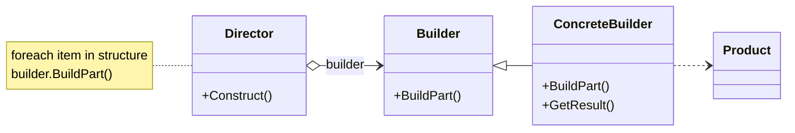
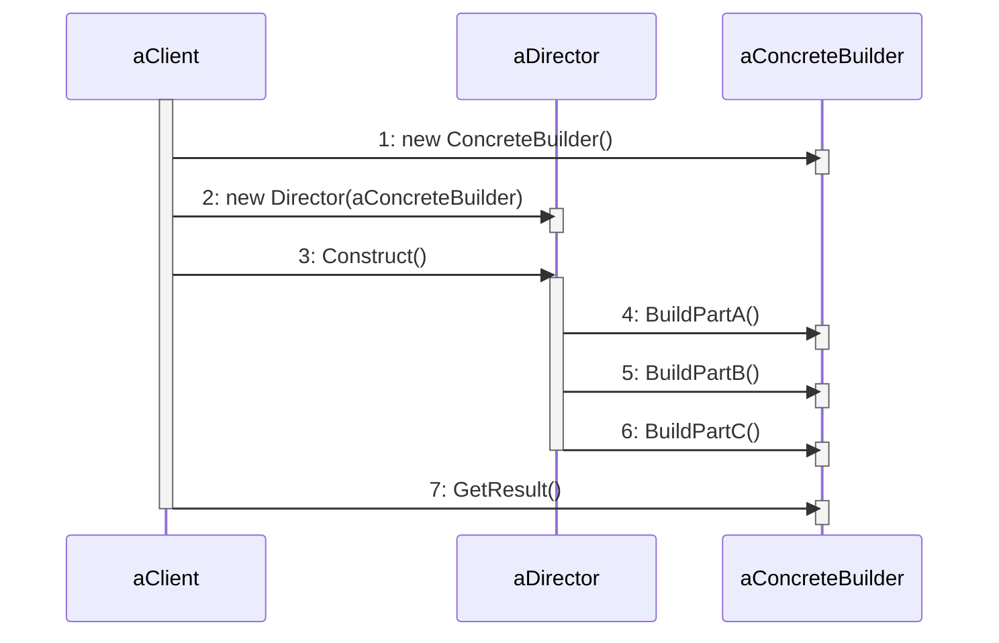

- **Builder**: especifica una interface abstracta para crear partes de un producto
- **ConcreteBuilder**: construye y ensambla partes del producto
	- guarda referencia al producto en construcción
- **Director**: conoce los pasos para construir el objeto 
	- utiliza el Builder para construir las partes que va ensamblando 
	- en lugar de pasos fijos puede seguir una "especificación"
- **Product**: es el objeto complejo a ser construido

#### **Consecuencias**

- Puntos a favor
	- Abstrae la construcción compleja de un objeto complejo
	- Permite variar lo que se construye Director <-> Builder
	- Da control sobre los pasos de construcción
- Puntos en contra
	- Requiere diseñar e implementar varios roles
	- Cada tipo de producto requiere un ConcreteBuilder
	- Builder suelen cambiar o son parsers de specs (mayor complejidad)

>[!important]- Consideraciones
>1. El director solo sabe hacer una cosa
>2. Los Builders pueden saber hacer cosas que no rquiera un Director pero si otro
>3. Los Builders funcionan (generalmente) "inyectando dependencias" para armar configuraciones en run-time
>4. Otros Directores pueden usar los mismos Builders
>5. Nuevas definiciones -> nuevos Directores
>6. Nuevos servicios -> nuevos Builders

# Patrón Decorator

#### **Intención**

- El objetivo es agregar comportamiento a un objeto dinámicamente y en forma tranparente 
- Cuando queremos agregar comportamiento adicional a ciertos objetos de una clase, una opción es usar herencia. Sin embargo presenta limitaciones cuando necesitamos que ese comportamiento se pueda agregar o quitar dinámicamente en tiempo de ejecución. En esos casos, la herencia no es adecuada, ya que implica una decisión estática. Esta rigidez hace que la herencia no sea flexible para escenarios donde los objetos necesitan "mutar de clase" o modificar su comportamiento de forma dinámica. La solución es definir un decorador (o "wrapper") que agregue el comportamiento cuando sea necesario
#### **Aplicabilidad**

- Agregar responsabilidades a objetos individualmente y en forma transparente (sin afectar otros objetos)
- Quitar responsabilidades dinámicamente
- Cuando subclasificar es impráctico

#### **Estructura**

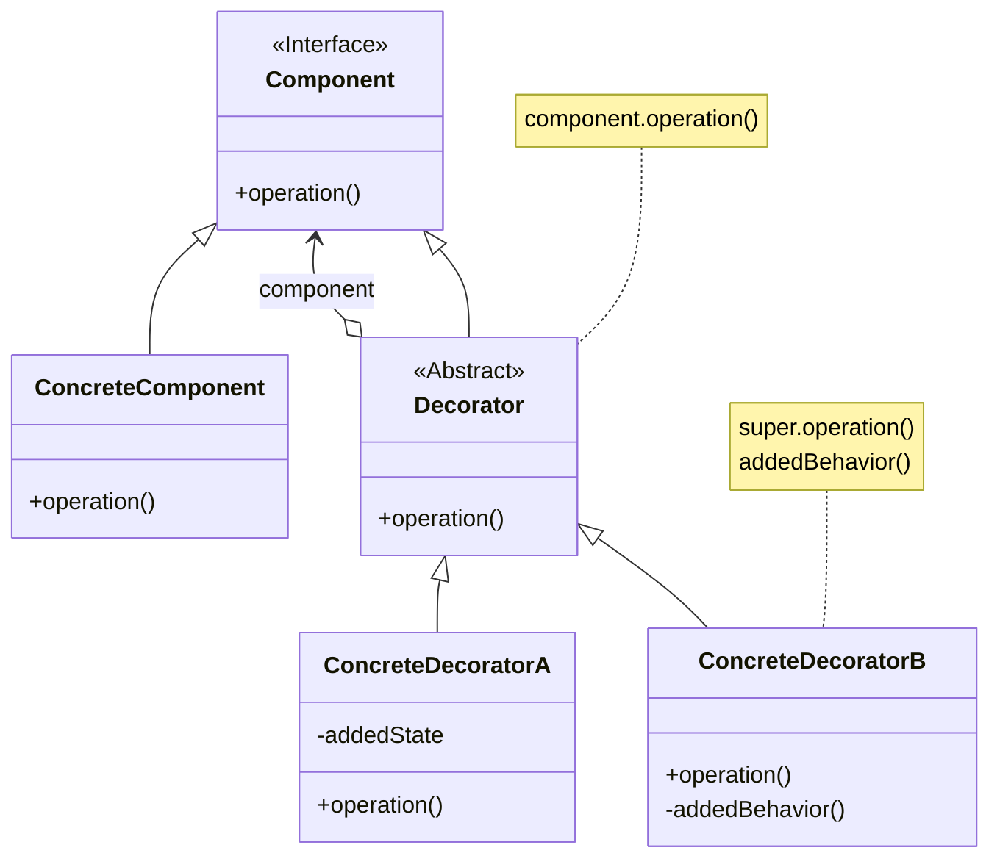

#### **Consecuencias**

- Puntos a favor
	- Permite mayor flexibilidad que la herencia 
	- Permite agregar funcionalidad incrementalmente 
- Puntos en contra
	- Mayor cantidad de objetos, complejo para depurar

#### **Implementación**

- Misma interface entre componente y decorador.
- No hay necesidad de la clase Decorador abstracta, si se tiene un solo decorador
- Cambiar el "skin" vs cambiar sus "guts"
	- Decorator puede verse como una "piel" que modifica el comportamiento externo, no la estructura interna (los "guts")
	- es decir, no cambiamos su estructura interna

# Patrón Proxy

#### **Intención**

Proporcionar un intermediario de un objeto para controlar su acceso.
Una de las razones para controlar el acceso a un objeto es posponer el costo completo de su creación e inicialización hasta que realmente necesitemos usarlo 

#### **Aplicabilidad**

- Cuando se necesita una referencia más flexible hacia un objeto
- Hay diferentes aplicaciones del proxy
	- **Virtual proxy**: demorar la construcción de un objeto hasta que sea realmente necesario, cuando sea poco eficiente acceder al objeto
	- **Protection proxy**: restringir el acceso a un objeto por seguridad
	- **Remote proxy**: representar un objeto remoto en el espacio de memoria local. Es la forma de implementar objetos distribuidos. Estos proxies se ocupan de la comunicación con el objeto remoto, y de serializar/deserializar los mensajes y resultados 
- Colocar un objeto intermedio que respete el protocolo del objeto que está reemplazando 
- Algunos mensajes se delegarán en el objeto en el objeto original. En otros casos puede que el proxy colabore con el objeto original o que reemplace su comportamiento 
#### **Estructura**

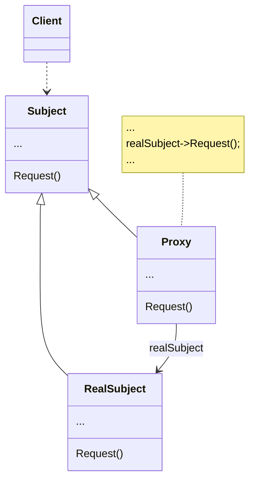
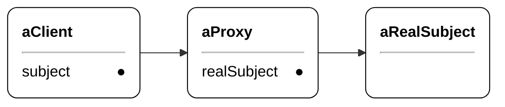

#### **Consecuencias**

- Puntos a favor
	- El patrón introduce un nivel de indirección que permite controlar el acceso al objeto real, lo que ofrece flexibilidad en su uso
- Puntos en contra 
	- Complejidad adicional

# Comparaciones de patrones

#### **Strategy vs State**

| Característica                          | State                                                                                                     | Strategy                                                                                                               |
| :-------------------------------------- | :-------------------------------------------------------------------------------------------------------- | :--------------------------------------------------------------------------------------------------------------------- |
| **Comportamiento**                      | el comportamiento de un objeto depende del estado en el que se encuentre                                  | Necesito uno de diferentes algoritmos opcionales para realizar una misma tarea                                         |
| **Utilidad**                            | es útil para una clase que debe realizar transiciones entre estados diferentes                            | es útil para permitir que una clase delegue la ejecución de un algoritmo a una instancia de una familia de estrategias |
| **Diferentes estados y estrategias**    | los diferentes estados son internos al contexto y no los eligen las clases clientes                       | las diferentes estrategias son conocidas desde afuera del contexto, por las clases clientes del contexto               |
| **Transición**                          | la transición se realiza entre los estados mismos                                                         | el contexto del Strategy debe contener un mensaje público para cambiar el ConcreteStrategy                             |
| **Privacidad**                          | el estado es privado del objeto, ningún otro objeto sabe de él                                            | el Strategy suele setearse por el cliente, que debe conocer las posibles estrategias concretas                         |
| **Cantidad de mensajes**                | cada State puede definir muchos mensajes                                                                  | un Strategy suele tener un único mensaje público                                                                       |
| **Conocimiento entre clases concretas** | los States concretos se conocen entre sí. Saben a cual estado se debe pasar en respuesta de algún mensaje | los Strategies concretos no se conocen                                                                                 |

#### **Decorator vs Adapter**
| Característica     | Decorator                                        | Adapter                                           |
| :----------------- | ------------------------------------------------ | ------------------------------------------------- |
| **Comportamiento** | preserva la interface del objeto para el cliente | convierte la interface del objeto para el cliente |
| **Anidación**      | pueden y suelen anidarse                         | no se anidan                                      |
- Ambos patrones "decoran" el objeto para cambiarlo

#### **Decorator vs Composite**

| Característica | Decorator                                           | Composite                                                                             |
| :------------- | --------------------------------------------------- | ------------------------------------------------------------------------------------- |
| **Estructura** | mantiene una estructura con sólo un siguiente       | Mantiene una estructura de árbol, un Composite usualmente se compone de varias partes |
| **Propósito**  | el propósito es agregar funcionalidad dinámicamente | El propósito es componer objetos y tratarlos de manera uniforme                       |
#### **Decorator vs Strategy**

| Característica           | Decorator                                | Strategy                                  |
| :----------------------- | ---------------------------------------- | ----------------------------------------- |
| **Cambio del algoritmo** | cambia el algoritmo por fuera del objeto | cambia el algoritmo por dentro del objeto |
- Ambos tienen el mismo propósito, permiti que un objeto cambie su funcionalidad dinámicamente (agregando o camiando el algoritmo que utiliza
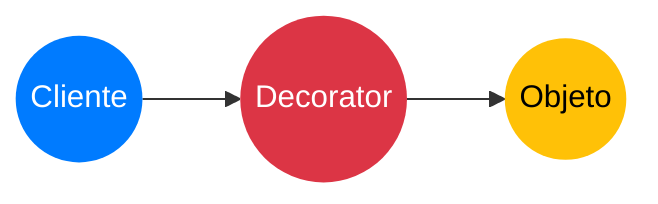
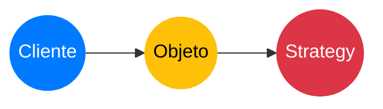

#### **Proxy vs Adapter**
| Característica             | Proxy                                       | Adapter                                                 |
| :------------------------- | ------------------------------------------- | ------------------------------------------------------- |
| **Interfaz proporcionada** | proporciona la misma interfaz que su sujeto | proporciona una interfaz diferente al objeto que adapta |
#### **Proxy vs Decorator**
| Característica | Proxy                          | Decorator                                      |
| :------------- | ------------------------------ | ---------------------------------------------- |
| **Propósito**  | controla el acceso a un objeto | agrega una o más responsabilidades a un objeto |
#### **Adapter, Decorator y Proxy**
- Todos son patrones estructurales
- Todos con diagramas de objetos similares
- Distinto propósito
- A todos se los llama "wrappers"
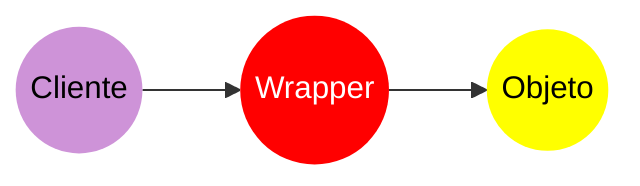

# Clasificación de patrones 

| Creacional | Estructural                          | Comportamiento                   |
| :--------- | ------------------------------------ | -------------------------------- |
| Builder    | Adapter, Composite, Decorator, Proxy | Template Method, State, Strategy |
