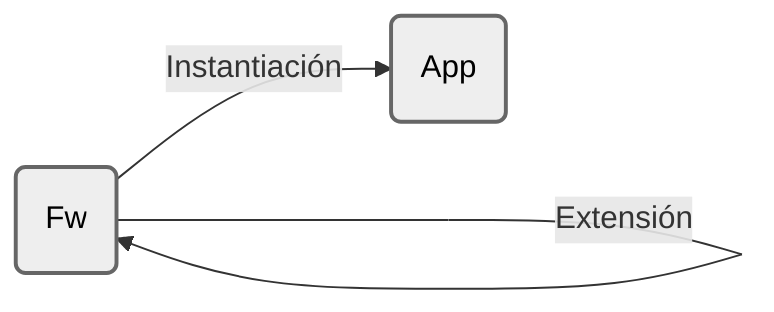

# Reuso

El reuso consiste en utilizar elementos de software existentes (como código, diseños, documentación o arquitecturas) para construir nuevos sistemas en lugar de desarrollarlos desde cero. No se limita solo a copiar código; abarca desde el uso de pequeñas funciones y objetos, pasando por **frameworks** (que reusan diseño y flujo de control) y **patrones** (que reusan soluciones abstractas), hasta la integración de sistemas completos (como COTS o líneas de productos)

- Ventajas
	- Menor esfuerzo
	- Menor tiempo de desarrollo
	- Menor incertidumbre
	- Mayor consistencia
	- Mayor confiabilidad
		- funcionó para n casos anteriores
	- Promueve trabajo en equipo 
	- Adquisición tecnológica
		- llave de mano 
		- know-how
- Desventajas
	- Requiere mantener configuraciones de software (versiones de dependencias)
	- Riesgo de dependencias no deseadas
	- Curva de aprendizaje 
	- Código externo 
		- Dependencia tecnológica
		- Resistencia a adopción
		- Riesgo de seguridad
	- Desarrollo de código reusable
		- Requiere tiempo 
		- Requiere conocimiento detallado 
			- Basado en casos
			- Experto en el tema 

#### Modos de reuso

- Copy & Paste
- Herencia & Polimorfismo 
- Extraer & Delegar
- Librerías
- Frameworks

#### Librerías OO

- Se reusa código 
- (OO) => Conjunto de clases 
	- Funcionalidad 
		- instancias 
		- clase (estática)
	- sistema/módulo 
		- crea instancias 
		- invoca la funcionalidad
#### Frameworks

>[!important]
> Un Framework es una aplicación "semi-completa", "reusable", que puede ser especializada para producir aplicaciones a medida. 

>[!important]
> Un Framework OO es un conjunto de clases concretas y abstractas, relacionadas para proveer una arquitectura reusable que implementa una familia de aplicaciones relacionadas

- Se reusa ...
	- una manera de ejecutar
	- una manera de instanciar
	- una manera de extender
- Es incompleto. No hace nada concreto
- (OO) => Conjunto de clases
	- Framework controla la ejecución (execution thread)
		- Inversión de control
	- Cookbook - reglas de uso
		- Instanciación - Implementar aplicación
			- White-box: thread incompleto
			- Black-box: thread configurable
		- Extensión - agregar opciones

Los frameworks son una de las técnicas de reuso más potentes porque permiten reutilizar la **arquitectura** y el **diseño** de una aplicación, no solo sus componentes individuales. Definen el esqueleto de la aplicación y el flujo de control, permitiendo al desarrollador enfocarse solo en los detalles específicos del dominio
# Framework de Caja Blanca

Se llaman "Caja Blanca" porque su arquitectura y sus detalles de implementación deben ser visibles y comprendidos por el desarrollador para poder extenderlos. La funcionalidad existente se reutiliza y extiende heredando de las clases base del framework y sobreescribiendo métodos hook predefinidos

- La instanciación hereda y completa el loop de control agregando código, es decir, modifican o extienden el código fuente (loop de control + hook classes)
	- Ejercitando un hotspot con herencia 
	- Modificando código fuente del framework
- Es posible que requiera agregar métodos a clases del framework
- Demanda conocimiento del código del framework

>[!note]
>Dependen fuertemente de la herencia y el enlace dinámico para lograr extensibilidad

# Framework de Caja Negra

Se llaman "Caja Negra" porque el desarrollador no necesita conocer la implementación interna, solo necesita entender la interfaz externa de los componentes. La funcionalidad se reutiliza definiendo componentes que cumplen con una interfaz específica e integrándolos en el framework, a menudo delegando la funcionalidad en lugar de heredarla 

- Las instanciaciones se basan en configuraciones

>[!note]
>Soportan extensibilidad definiendo interfaces para componentes que pueden conectarse al framework mediante composición de objetos

# Caja Blanca vs Caja Negra

| Característica             | Caja Blanca                                                                                | Caja Negra                                                                                  |
| :------------------------- | ------------------------------------------------------------------------------------------ | ------------------------------------------------------------------------------------------- |
| **Mecanismo de extensión** | Herencia y sobreescritura de métodos                                                       | Composición y delegación de objetos                                                         |
| **Acoplamiento**           | **Alto**: las subclases dependen fuertemente de la implementación de las clases base       | **Bajo**: los componentes solo dependen de las interfaces especificadas                     |
| **Facilidad de uso**       | Requiere entender la estructura interna del framework, tiene una curva de aprendizaje alta | Más fácil de usar, alcanza con entender las interfaces, tiene una curva de aprendizaje baja |

# HotSpots vs FrozenSpot

#### FrozenSpot

 Aspecto del framework que afecta a todas las instanciaciones y que no se puede modificar (marca indeleble)
#### HotSpot

Estructura en el código que permite modificar el comportamiento del framework, para instanciar y para extender. Son partes del diseño pensadas para adaptarse
- Hook Methods
- Hook Classes (hoy en día es poco usual que existan)

>[!tip]
> Si en el diseño de un framework identificamos un patrón, la estructura correspondiente seguramente es un hotspot

# Inversión de control 

>[!note]
>Describe un cambio en la responsabilidad sobre la ejecución del programa

En el entorno de los frameworks, son estos los que poseen el programa principal y el control de flujo. Y son ellos los que "llaman" al código del desarrollador. El framework determina la estructura general y cuándo se deben ejecutar las tareas

