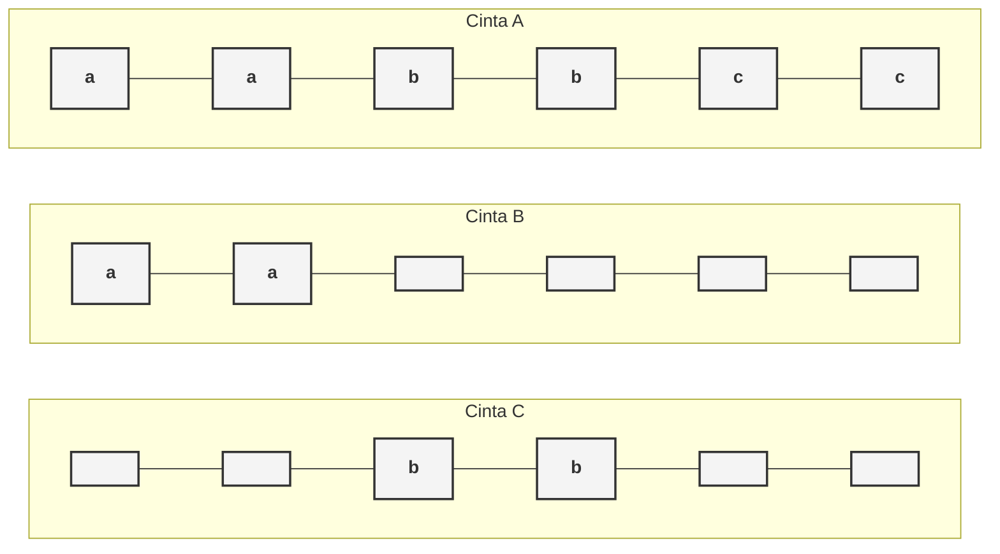
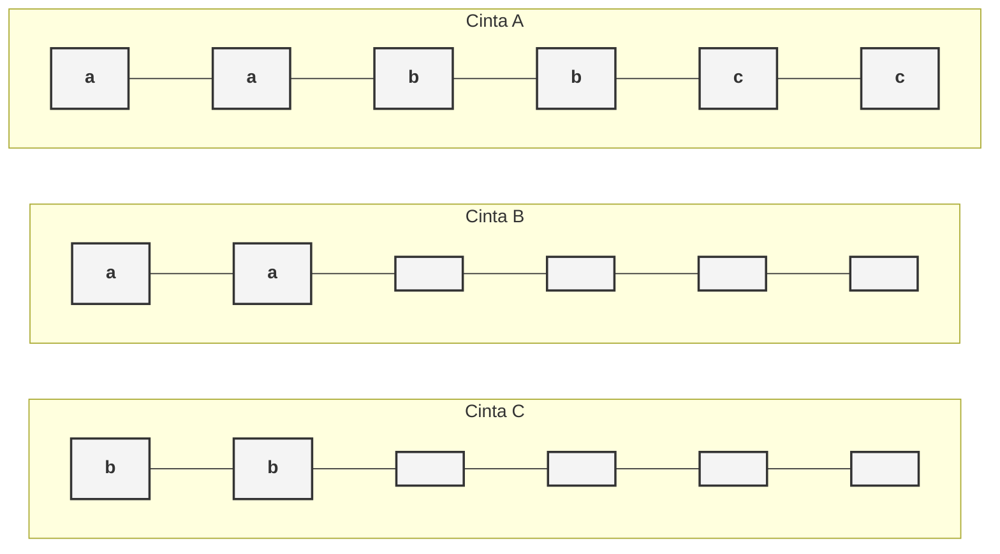

Ejercicio 1. Responder breve y claramente los siguientes incisos: 
1. ¿En qué se diferencia un problema de búsqueda de un problema de decisión?

En su respuesta. 
- Un problema de busqueda devolvera una solución especifica, ej el camino que corresponde, si la respuesta es afirmativa, o un **no** si la respuesta es negativa. 
- Un problema de decision nos devolvera si, en caso afirmativo, o no, en caso negativo.

2. ¿Por qué en el caso de los problemas de decisión, podemos referirnos indistintamente a problemas y lenguajes? 

Podemos usarlos indistintamente porque cualquier problema de decisión puede formalizarse como un **lenguaje L**, donde L es el conjunto de todas las cadenas que representan instancias del problema cuya respuesta es **SÍ**. Resolver el problema equivale a decidir si una cadena pertenece al lenguaje.Nos referimos a ellos indistintamente porque **resolver un problema de decisión es exactamente lo mismo que determinar si una cadena pertenece a un lenguaje**. 
3. El problema de satisfactibilidad de las fórmulas booleanas, en su forma de decisión, es: “Dada una fórmula φ, ¿existe una asignación A de valores de verdad que la hace verdadera?” Enunciar el problema de búsqueda asociado. 
Si. Entiendo que el problema de busqueda va por el lado de: 
Una formula  φ es satisfactible, con los valores x1, x2...xn, con n>= 1, si existe al menos una configuración de verdad en la la formula devuelve verdadero. 

4. Otra visión de MT es la que genera un lenguaje (visión generadora). En el caso del problema del inciso anterior, ¿qué lenguaje generaría la MT de visión generadora que resuelve el problema? 

![[Pasted image 20260310132243.png]]
La máquina "imprimiría" todas las codificaciones de fórmulas que tienen al menos una asignación que las hace verdaderas. Como no se cuantas variables tiene no puedo responder más allá de eso

5. ¿Qué postula la Tesis de Church-Turing? 
Hay enunciados matemáticos que no se puede decidir mecánicamente si son verdaderos o falsos.
Gemini dice: Postula que **todo proceso que pueda ser considerado un "algoritmo" o cálculo efectivo puede ser llevado a cabo por una Máquina de Turing**. Define el límite de lo que es físicamente computable.

6. ¿Cuándo dos MT son equivalentes? ¿Y cuándo dos modelos de MT son equivalentes? 
Son equivalentes si, dado el mismo alfabeto, aceptan el mismo lenguaje. Los dos modelos son equivalentes si para toda MT de un model,  existe una MT equivalente en el otro.

Ejercicio 2. Dado el alfabeto Ʃ = {0, 1}: 
1. Obtener el conjunto Ʃ* y el lenguaje incluido en Ʃ* con cadenas de a lo sumo 2 símbolos. 
Ʃ*={λ,0,1,00,01,10,11,000,001,010,011,100,101,110,111} 
Ʃ* = {w | w es una cadena finita formada por los simbolos de Ʃ}
> [!NOTE] duda
>Ʃ* es infinito, cuanto del conjunto escribo?

L = {λ,0,1,00,01,10,11}
L = {w ∈ Ʃ* | la longitud de w <= 2 }
2. Sea el lenguaje L = {0n1n | n ≥ 0}. Obtener los lenguajes 
	Ʃ* ⋂ L = L. Por definición, L es un subconjunto de Ʃ*. 
	Ʃ* ⋃ L = Ʃ*
Lᶜ respecto de Ʃ* = {0,1,00,10,11,001,010,011,100,110,111,0000, ...} = Ʃ* - L

Ejercicio 3. En clase se mostró una MT no determinística (MTN) que acepta las cadenas de la forma han o hbn, con n ≥ 0. Construir (describir la función de transición) una MT determinística (MTD) equivalente. 

MT M = (Q, Γ, δ, q0, qA, qR):
Estados posibles Q= 
- q0 = busco una h
- qaux = Estado que reemplaza el no determinismo.  
- qa= espero una a
- qb= espero una b

Función: 
1. δ(q0, h) = (qaux, h , R)
2. δ(qaux, a) = (qa,a,R)
3. δ(qaux, b) = (qb,b,R)
4. δ(qaux, B) = (qA,B,S) -> caso en que la cadena era solo H
5. δ(qa, a) = (qa,a,R)
6. δ(qb, b) = (qb,b,R)
7. δ(qa, B) = (qA,B,S) -> B es blanco
8. δ(qb, B) = (qA,B,S)

Agrego tres casos adicionales para hacer el no determinismo y un estado intermedio para determinar cual es la letra.

Ejercicio 4. Describir la idea general de una MT con varias cintas que acepte, de la manera más eficiente posible (menor cantidad de pasos), el lenguaje L = {anbncn | n ≥ 0}. 

Se me ocurre parecido al ejemplo de la practica, copio las a, copio las b y me quedo parado en las c. Requiero 3 cintas.
Arrancó, si tengo una a la copio en la cinta B y continuo hasta encontrar una b.
Copió todas las b en la cinta C hasta encontrar una c. 
En este punto puedo chequear con los tres cabezales a la vez:
- Cinta A -> tengo una c? me muevo a la derecha 
- Cinta B -> tengo una a? me muevo a la izquierda 
- Cinta C-> tengo una b? me muevo a la izquierda 
Si los tres cabezales alcanzaron una B (blanco) al mismo tiempo, qA. Sino qR (entiendase cualquier otro caso, tipo una letra que no sea a,b o c o tener más de una de ellas)

No es necesario si o si mover todas las cabezas mientras copias. Podria ser perfectamente un: 

Ejercicio 5. Explicar cómo una MT sin el movimiento S (el no movimiento) puede simular (ejecutar) otra que sí lo tiene. 

Solo se me ocurré pasos de más. Me muevo a la izquierda o derecha cambiando a otro estado y en forma indistinta me muevo de nuevo a donde estaba.

- δ(qalgo, h) = (qaux, X , R)
- δ(qaux, T) = (qotro, T , L)

>[!NOTE] salvedad
>X es el dato que tenia que cambiar. Me muevo a la derecha e inmediatamente me muevo a la izquierda. Voy a multiplicar el segundo paso por cada simbolo del abecedario (T deberia de ser un simbolo)

Ejercicio 6. En clase se construyó una MT con 2 cintas que acepta L = {w | w ∈ {a, b}* y w es un palíndromo}. Construir una MT equivalente con 1 cinta. Ayuda: la solución que vimos para aceptar el lenguaje de las cadenas anbn, con n ≥ 1, puede ser un buen punto de partida. 

PROBLEMA: decidir si una cadena w de cero o más símbolos a y b es un palíndromo o capicúa (w es igual a wR, siendo wR la cadena inversa de w). Por ejemplo, la cadena w = aabbbaa es un palíndromo
MT M = (Q, Γ, δ, q0, qA, qR):
- Alfabeto Γ = {a, b, …, z, α, β, B}
- Estados Q = {q0, qa, qb, qL, qFinA, qFinB, qInicioA, qInicioB, qA, qR}
	q0 : estado inicial (M busca una letra)
	qL: M busca una letra (L es de letra, es el que determina el lado izquierdo)
	qFinA : M va al fin de la cadena buscando una "a" en el lado derecho
	qFinB : M va al fin de la cadena buscando una "b" en el lado derecho
	qa: M busco una a
	qb: M busco una b
	qInicioA : M vuelve hasta encontrar una  α
	qInicioB: M vuelve hasta encontrar una β

Función de transición δ:
1. δ(q0, B) = (qA, B, S) -> cadena vacia, acepto 
2. δ(q0, a) = (qFinA, α, R) -> primera letra a, marco y voy a buscar una a al lado opuesto
3. δ(qFinA, a) = (qFinA, a, R) -> no llegue al fin, sigo
4. δ(qFinA, b) = (qFinA, b, R) -> no llegue al fin, sigo
5. δ(qFinA, B) = (qa, B, L) -> encontre fin, volve
6. δ(qFinA, α) = (qa, α, L) -> por acá ya pasé
7. δ(qFinA, β ) = (qa, β, L) -> por acá ya pasé
8. δ(qa, a) = (qInicioA, α , L) -> marcó
9. δ(qInicioA, a) = (qInicioA, a, L) -> sigo
10. δ(qInicioA, b) = (qInicioA, b, L) -> sigo
11. δ(qInicioA, α) = (qL, α, R) -> llegué a la que marqué recien
12. δ(qL, a) = (qFinA, α, R) -> siguiente letra es a
13. δ(qL, b) = (qFinB, β, R) -> siguiente letra es b
14. δ(qFinB, a) = (qFinB, a, R) -> no llegue al fin, sigo
15. δ(qFinB, b) = (qFinB, b, R) -> no llegue al fin, sigo
16. δ(qFinB, B) = (qb, B, L) -> encontre fin, volve
17. δ(qFinB, α) = (qb, α, L) -> por acá ya pasé
18. δ(qFinB, β ) = (qb, β, L) -> por acá ya pasé
19. δ(qb, b) = (qInicioB, β , L) -> marcó
20. δ(qInicioB, a) = (qInicioB, a, L) -> sigo
21. δ(qInicioB, b) = (qInicioB, b, L) -> sigo
22. δ(qInicioB, β) = (qL, β, R) -> llegué a la que marqué recien
23. δ(q0, b) = (qFinB, β, R)
24. δ(qb, β) = (qA, β, S)
25. δ(qa, α) = (qA, α, S)
26. δ(qL, α) = (qA, α, S)
27. δ(qL, β) = (qA, β, S)

Ejercicio 7. Construir una MT que calcule la resta de dos números. Ayuda: se puede considerar la idea de solución propuesta en clase. 

MT M = (Q, Γ, δ, q0, qA, qR):
- Alfabeto Γ = {1,0, B}
- Estados Q = {q0, qa, qb, qL, qH, qA, qR}
q0 = Estado Inicial(tachar un 1)
qf= M va al fin de la cadena
qr= M elimina el ultimo 1.
qi= M vuelve al comienzo.
ql= M resta el primer 1.
qh = M no hay más 1 en el lado derecho.

Función de transición δ:
1. δ(q0, B) = (qA, B, S) -> lo dejo? caso en que no me dan entrada, se podria rechazar
2. δ(q0, 1) = (qf, B, R)
3. δ(qf, 1) = (qf, 1, R)
4. δ(qf, 0) = (qf, 0, R)
5. δ(qf, B) = (qr, B, L)
6. δ(qr, 1) = (qi, B, L)
7. δ(qi, 1) = (qi, 1, L)
8. δ(qi, 0) = (qi, 0, L)
9. δ(qi, B) = (ql, B, R)
10. δ(ql, 1) = (qf, B, R)
11. δ(ql, 0) = (qA, 0, S)
12. δ(qr, 0) = (qA, 1, S)
Tacho el primer 1 y el ultimo hasta que cuando quiero tachar me encuentro un 0. Paro mi ejecucion. Si l>r el resultado es positivo (110) y caso contrario es negativo (011)

Ejercicio 8. Construir una MT que genere todas las cadenas de la forma anbn, con n ≥ 1. Ayuda: se puede considerar la idea de solución propuesta en clase.

MT M = (Q, Γ, δ, q0, qA, qR):
- Alfabeto Γ = {0,1,2,3,4,5,6,7,8,9,a,b, B}
- Estados Q = {q0, qn,qe, qA, qR}
q0 = Estado Inicial(leer cantidad ingresada y -1)
qf= M va al fin de la cadena
qr= M elimina el ultimo 1.
qi= M vuelve al comienzo.
ql= M resta el primer 1.
qh = M no hay más 1 en el lado derecho.

Función de transición δ:
1. δ(q0, B) = (qA, B, S)
2. δ(q0, 0) = (qA, B, S)
3. δ(q0, 1) = (qea, 1, L)
4. δ(q0, 2) = (qea, 2, L)
5. δ(q0, 3) = (qea, 3, L)
6. δ(q0, 4) = (qea, 4, L)
7. δ(q0, 5) = (qea, 5, L)
8. δ(q0, 6) = (qea, 6, L)
9. δ(q0, 7) = (qea, 7, L)
10. δ(q0, 8) = (qea, 8, L)
11. δ(q0, 9) = (qea, 9, L)
12. δ(qea, a) = (qea, a, L)
13. δ(qea, B) = (qv, a, R)

14. δ(qv, a) = (qv, a, R)
15. δ(qv, 1) = (qA, b, S)
16. δ(qv, 2) = (qeb, 2, R)
17. δ(qv, 3) = (qeb, 3, R)
18. δ(qv, 4) = (qeb, 4, R)
19. δ(qv, 5) = (qeb, 5, R)
20. δ(qv, 6) = (qeb, 6, R)
21. δ(qv, 7) = (qeb, 7, R)
22. δ(qv, 8) = (qeb, 8, R)
23. δ(qv, 9) = (qeb, 9, R)
24. δ(qeb, b) = (qeb, b, R)
25. δ(qeb, B) = (qv2, b, L)

26. δ(qv2, b) = (qv2, b, L)
27. δ(qv2, 1) = (qea, 1, L)
28. δ(qv2, 2) = (qea, 1, L)
29. δ(qv2, 3) = (qea, 2, L)
30. δ(qv2, 4) = (qea, 3, L)
31. δ(qv2, 5) = (qea, 4, L)
32. δ(qv2, 6) = (qea, 5, L)
33. δ(qv2, 7) = (qea, 6, L)
34. δ(qv2, 8) = (qea, 7, L)
35. δ(qv2, 9) = (qea, 8, L)

ALT
δ(q0, (B,B)) = (qa,(1, R) (a,R))
δ(qa, (1,B)) = (qa,(1, R) (a,R))
δ(qa, (B,B)) = (qb,(B, L) (B,S))
δ(qb, (1,B)) = (qb,(1, L) (b,R))
δ(qb, (B,B)) = (qa,(1, S) (/,S))

