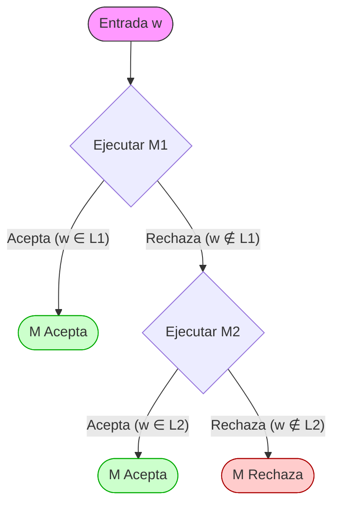
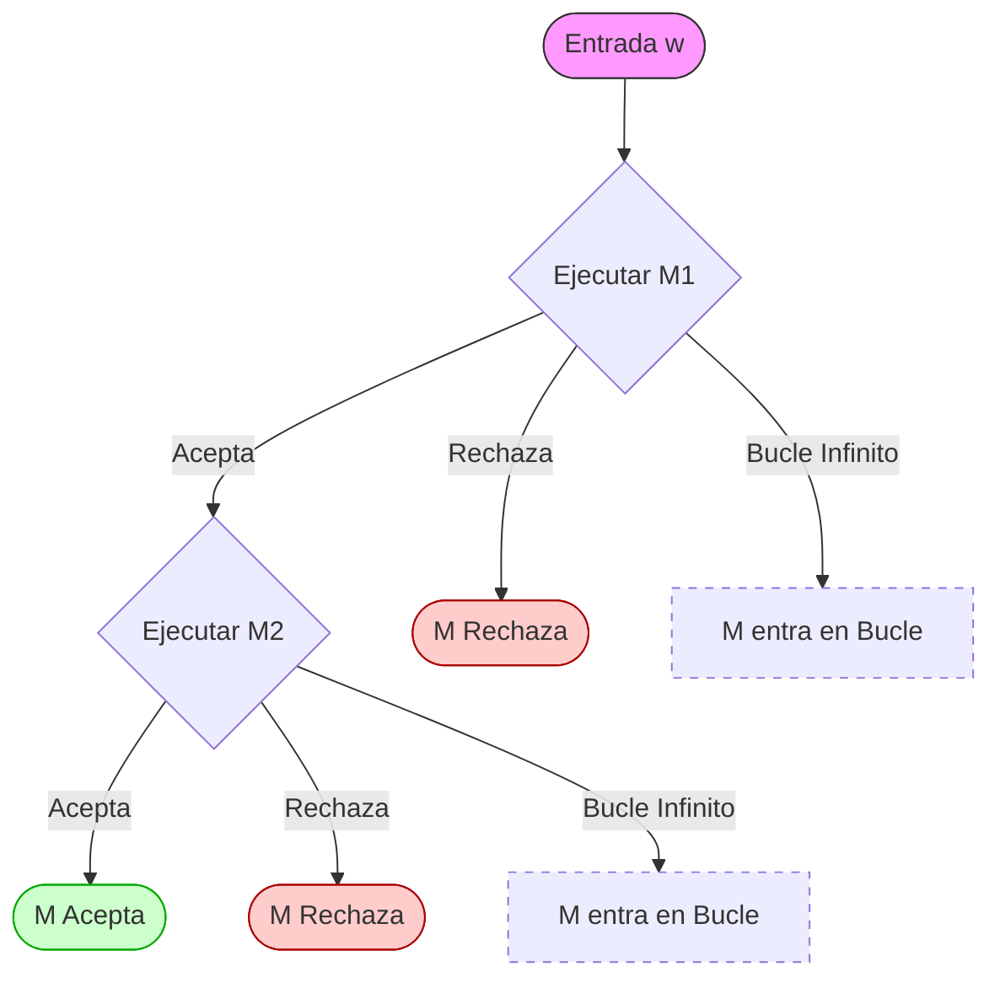

# Ejercicio 1. 
Responder breve y claramente los siguientes incisos:
1. ¿En qué se diferencian los lenguajes recursivos, los lenguajes recursivamente enumerables no recursivos y los lenguajes no recursivamente enumerables?

 lenguajes recursivos: aquellos lenguajes sobre los que podemos construir una maquina de turing que simpre decida por si o por no.
 
 lenguaje recursivamente enumerable: aquellos lenguajes sobre los que podemos definir una maquina de turing que en caso afirmativo siempre responde que si y en casos negativo puede responder que si o loopear.

lenguaje no recursivamente enumerables:  No existe ninguna MT capaz siquiera de reconocer todas las cadenas del lenguaje; para algunas cadenas que sí pertenecen, la MT nunca se detendría.
 
1. Probar que R  RE  L. Ayuda: usar las definiciones.
Si L es el conjunto de todos los lenguajes RE esta contenido dentro de él. R esta contenido dentro de RE debido a que el subconjunto que este siempre pare esta contenido dentro del que **puede** no parar 

2. Dijimos en clase que el hecho de que si L es recursivo entonces LC también lo es, significa en términos de problemas que si un problema es decidible entonces también lo es el problema contrario. ¿Qué significa en términos de problemas que la intersección de dos lenguajes recursivos es también un lenguaje recursivo?

Si puedes decidir L1​ y L2​, puedes construir una MT que corra ambas y acepte solo si ambas aceptan.

1. Explicar por qué no es correcta la siguiente prueba de que si L ∈ RE, también LC ∈ RE: dada una MT M que acepta L, entonces la MT M’, igual que M pero con los estados finales permutados, acepta LC.

La prueba falla porque en los lenguajes RE, la MT puede **no detenerse (entrar en bucle)** para cadenas que no pertenecen al lenguaje.

- Si solo permutas estados finales, las cadenas que antes hacían que la MT colgara (no aceptadas), seguirán haciendo que la MT cuelgue en la "nueva" máquina. No pasarán a ser "aceptadas", por lo que no estarías reconociendo el complemento.

2. ¿Qué lenguajes de la clase CO-RE tienen MT que los aceptan? ¿También los deciden?

Los que estan englobados dentro de R. Sobre la segunda pregunta si

3. Probar que el lenguaje Ʃ* de todas las cadenas y el lenguaje vacío ∅ son recursivos. Alcanza con plantear la idea general. Ayuda: encontrar MT que los decidan.

Para el lenguaje  Ʃ*  como contempla todas las cadenas bastaria con construir una maquina de turing que siempre devuelva positivo o si(qA). Caso contrario para el vacio, siempre devuelve negativo o no (qR).

4. Probar que todo lenguaje finito es recursivo. Alcanza con plantear la idea general. Ayuda: encontrar una MT que lo decida (pensar cómo definir sus transiciones para cada una de las cadenas del lenguaje).

Si poseo un lenguaje finito puedo construir una maquina de turing que siempre pare. Bastaria con iterar sobre el conjunto finito de elementos (se que no va a entrar en bucle porque es recorrer una lista finita), si esta lo acepto y sino qR
# Ejercicio 2.
Considerando la Propiedad 2 estudiada en clase:
a. ¿Cómo implementaría la copia de la entrada w en la cinta 2 de la MT M?
Seria necesario tener una marca de comienzo y fin, en la propia cinta o en otra auxiliar y pasar todos los simbolos que esten comprendidos entre la marca de inicio y la de fin. Pensando en la función de transición, seria necesario tener una transformación por cada posible combinación de simbolos del abecedario que estemos manejando.
b. ¿Cómo implementaría el borrado del contenido de la cinta 2 de la MT M?
Similar al punto anterior deberias mantener una marca de comienzo y fin, cuando se quiera borrar una de las cintas se debe cambiar todos los simbolos por B. El tener estos dos simbolos adicionales aumenta la complejidad de la maquina de Turing porque con cada transformación que cambie el tamaño de la cinta deberia de mover la marca (si disminuye a la izquierda o si aumenta a la derecha)

# Ejercicio 3
1. La clase R es cerrada con respecto a la operación de unión.
Ayuda: la prueba es similar a la desarrollada para la intersección.
**Teorema:** Si L1​,L2​∈R, entonces L1​∪L2​∈R.
**Demostración**
Como L1​ y L2​ son lenguajes **Recursivos (R)**, existen dos Máquinas de Turing (MT), M1​ y M2​, que los **deciden**. Esto significa que para cualquier entrada, ambas máquinas eventualmente se detienen y aceptan o rechazan. Dado que M1​ y M2​ siempre se detienen, M también se detendrá siempre. Por lo tanto, M es un decisor para L1​∪L2​, lo que prueba que el lenguaje es **R**. M acepta si M1 o  M2 aceptan la entrada, solo rechaza en caso de que ambas rechacen.

2. La clase RE es cerrada con respecto a la operación de intersección.
Ayuda: la prueba es similar a la desarrollada para la clase R.
Como L1​ y L2​ son **Recursivamente Enumerables (RE)**, existen dos MT, M1​ y M2​, que los **reconocen**. Esto significa que si w∈L, la máquina se detiene y acepta; pero si w∈/L, la máquina podría rechazar o entrar en un bucle infinito.
En este caso, el orden de ejecución (secuencial) funciona perfectamente porque para que w∈L1​∩L2​, **ambas** deben aceptar. Si M1​ entra en bucle, M también lo hará, lo cual es un comportamiento válido para una máquina que reconoce un lenguaje RE.
![[Pasted image 20260323225353.png]]

Este grafico es otra alternativa. No soy fan:

# Ejercicio 4.
Sean L1 y L2 dos lenguajes recursivamente enumerables de números naturales
codificados en unario (por ejemplo, el número 5 se representa con 11111). Probar que también es recursivamente enumerable el lenguaje L = {x | x es un número natural codificado en unario, y existen y, z, tales que y + z = x, con y ∈ L1, z ∈ L2}.
Ayuda: la prueba es similar a la vista en clase, de la clausura de la clase RE con respecto a la operación de concatenación.

Sea M1 una MT que decide el lenguaje L1 y M2 una MT que decide el lenguaje L2.
Hay que construir una MT M que decida el lenguaje L1 . L2. 
Como estamos trabajando en el terreno de los RE, puede darse el caso de que alguna de las dos maquinas (M1 o M2) loopee bajo alguna cadena que deberia de ser aceptada (por ejemplo en caso de que se le de una cadena vacia) debemos ejecutar ambas maquinas en paralelo en forma de pasos. Si alguno de los casos queda loopeando, es correcto, debido a que trabajamos en el conjunto RE y algunas instancias negativas pueden loopear. Hay que considerar que si bien los números naturales son infinitos como tenemos una entrada w finita podemos particionarla en una cantidad finita de particiones par, la idea centra de esta maquina de Turing es que en su paso 1 ejecuta el paso 1 del primer par, en el paso 2 ejecuta el segundo del primer par y el primer paso del segundo. Si cualquier combinación de particiones acepta la M se detiene, sino rechazará o loopeara.

Dado un input w con n símbolos, M hace:
1. M ejecuta M1 a partir de los primeros 0 símbolos de w, y M2 a partir de los últimos n símbolos de w.
Si en ambos casos se acepta, entonces M acepta.
2. Si no, M hace lo mismo que en (1) pero ahora con el 1er símbolo y los últimos (n – 1) símbolos de w.
Si en ambos casos se acepta, entonces M acepta.
3. Si no, M hace lo mismo que en (1) pero ahora con los primeros 2 y los últimos (n – 2) símbolos de w.
Si en ambos casos se acepta, entonces M acepta.
Y así siguiendo, con 3 y (n – 3), 4 y (n – 4), …, hasta llegar a n y 0 símbolos de w.
Si en ninguno de los casos se acepta, entonces M rechaza
# Ejercicio 5.
Dada una MT M1 con alfabeto Γ = {0, 1, B}:
1. Construir una MT M2, utilizando la MT M1, que acepte, cualquiera sea su cadena de entrada, sii la MT M1 acepta al menos una cadena.
El desafio esta en que no conocemos como esta construida M1 y no sabemos las cademas que acepta (podrian ser 0, 1 o infinitas), el caso de **al menos una** nos da la pauta que podemos construir una MT2 que simule una M1 (como M1 puede loopear deberiamos de ejecutar en paralelo todas las posibles combinaciones, cadena s1 loopea pero s2 era justo la que acepta la cadena, nunca lo sabría en forma secuencial. Tampoco puedo generar infinitas cadenas antes de lanzar la primera ejecución, genera k cadenas y probalas en forma paralela). Si M1 la acepta, automáticamente M1 se detiene y acepta la cadena.
2. ¿Se puede construir además una MT M3, utilizando la MT M1, que acepte, cualquiera sea su cadena de entrada, sii la MT M1 acepta a lo sumo una cadena? Justificar.
Esto no es posible, si existen infinitas combinaciones de cadenas que M1 puede aceptar deberíamos de probar para una misma entrada w todas las posibles combinaciones para determinar que SOLO una de ellas la acepta (considerar que si bien podemos tener una cadena que la acepte deberíamos verificar que todas las demás las rechacen). El único caso que podria parar esta MT seria al rechazar, si se aceptan dos cadenas. 
Ayuda para la parte (1): si M1 acepta al menos una cadena, entonces existe al menos una cadena de símbolos 0 y 1, de tamaño n, tal que M1 la acepta en k pasos. Teniendo en cuenta esto, pensar cómo M2 podría simular M1 considerando todas las cadenas de símbolos 0 y 1 hasta encontrar eventualmente una que M1 acepte (¡cuidándose de los casos en que M1 entre en loop!).