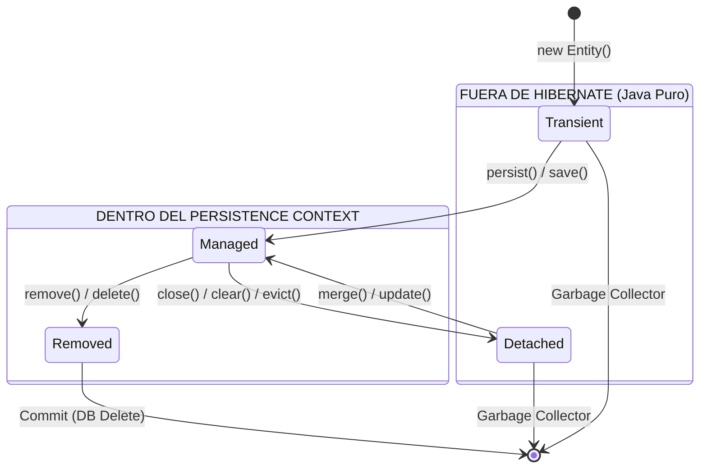

Describir los cuatro estados posibles de una entidad en Hibernate (transient, managed,
detached, removed) e indicar qué operación dispara cada transición entre ellos

### 1. Transient (Transitorio)
Es un objeto Java común y corriente (`new Route()`).
- **Estado:** No tiene representación en la base de datos (no tiene un ID asignado) y **no está asociado** a ninguna sesión de Hibernate. Si el objeto sale de alcance, el recolector de basura lo elimina y los datos se pierden.
- **Transición desde aquí:**
    - Hacia **Managed**: Se dispara con `session.save(entity)`, `session.persist(entity)` o `session.saveOrUpdate(entity)`.

### 2. Managed / Persistent (Gestionado)
El objeto está "vivo" dentro del contexto de Hibernate.
- **Estado:** Tiene un ID en la base de datos y la sesión tiene una referencia a él. Cualquier cambio que le hagas a sus atributos (ej: `route.setPrice(500.0)`) será detectado por el **Dirty Checking** y se sincronizará con la base de datos automáticamente al hacer el _commit_. 
- **Transición desde aquí:**
    - Hacia **Detached**: Se dispara al cerrar la sesión (`session.close()`), limpiar el contexto (`session.clear()`) o expulsar el objeto específico (`session.evict(entity)`).        
    - Hacia **Removed**: Se dispara con `session.delete(entity)` o `session.remove(entity)`.
        

### 3. Detached (Desprendido)
Es un objeto que estuvo gestionado pero cuya sesión ya se cerró.
- **Estado:** Tiene un ID que corresponde a un registro en la base de datos, pero Hibernate **ya no lo vigila**. Si modificas un atributo, esos cambios no se guardarán automáticamente. Es el estado típico de un objeto que viaja desde el DAO hasta la Vista (UI).
- **Transición desde aquí:**
    - Hacia **Managed**: Se dispara con `session.update(entity)`, `session.merge(entity)` o `session.saveOrUpdate(entity)`. Esto "reengancha" el objeto a una nueva sesión.
        
### 4. Removed (Eliminado)
El objeto está marcado para ser borrado.
- **Estado:** Todavía existe en la memoria de Java, pero Hibernate ha programado un `DELETE` para la próxima vez que se sincronice con la base de datos (usualmente al terminar la transacción).
- **Transición desde aquí:**
    - Hacia **Transient**: Una vez que se hace el _commit_ y el registro desaparece de la base de datos, el objeto vuelve a ser un simple objeto Java sin identidad persistente.

