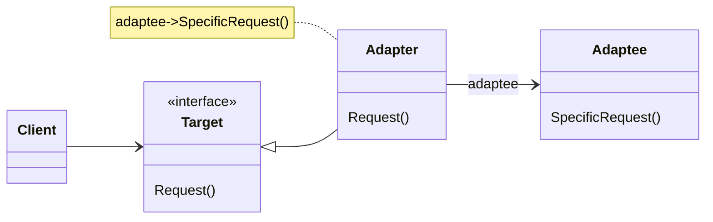
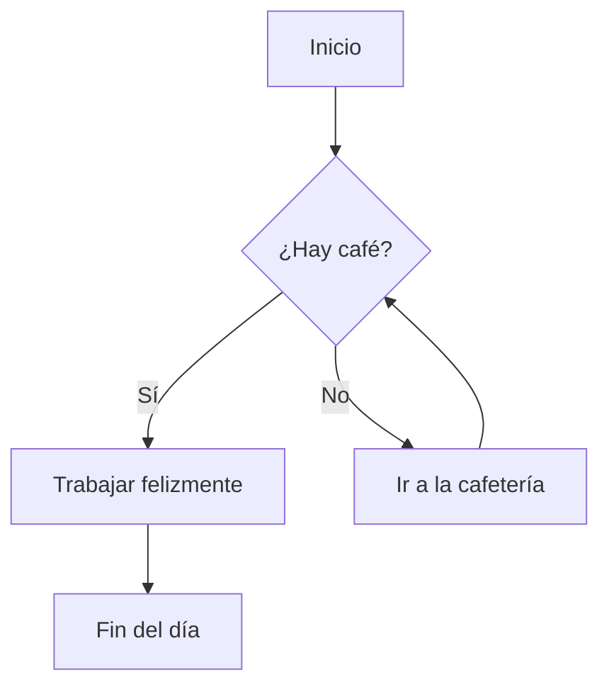
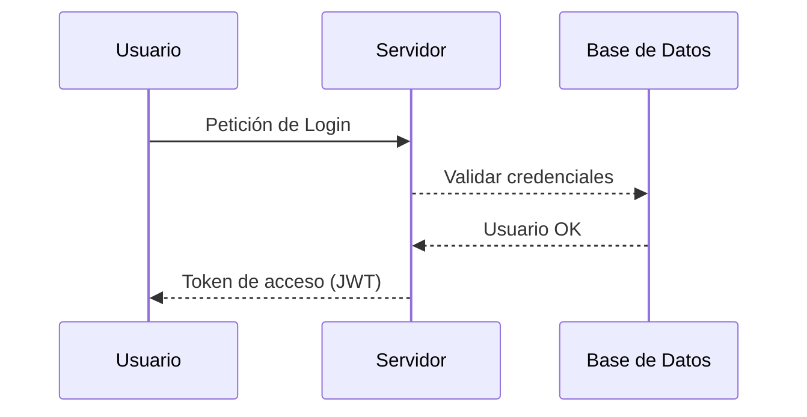
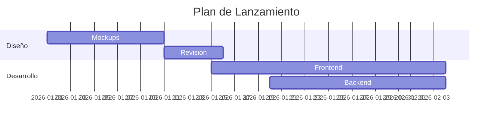

# Tipos de notas: 
 sfsd
## asdfgh
### asfdg
#### asfdgf
##### sdfgh
- sdfg
1. sfdf
> esdfg

 
>[!quote] cita
> para mencionar algun autor

> [!NOTE]
> Useful information that users should know, even when skimming content.

> [!TIP]
> Helpful advice for doing things better or more easily.

> [!IMPORTANT]
> Key information users need to know to achieve their goal.

> [!WARNING]
> Urgent info that needs immediate user attention to avoid problems.

> [!CAUTION]
> Advises about risks or negative outcomes of certain actions.

# Tipos de codigos

```java
public static Object getObjeto(String str, Integer num, int a){}
```










```diff 
def suma(a, b):
- resultado = a - b
+ resultado = a + b 
  return resultado
```

$$ f(x) = \int_{-\infty}^{\infty} \hat{f}(\xi) e^{2 \pi i \xi x} d\xi $$

<u>hola</u>
